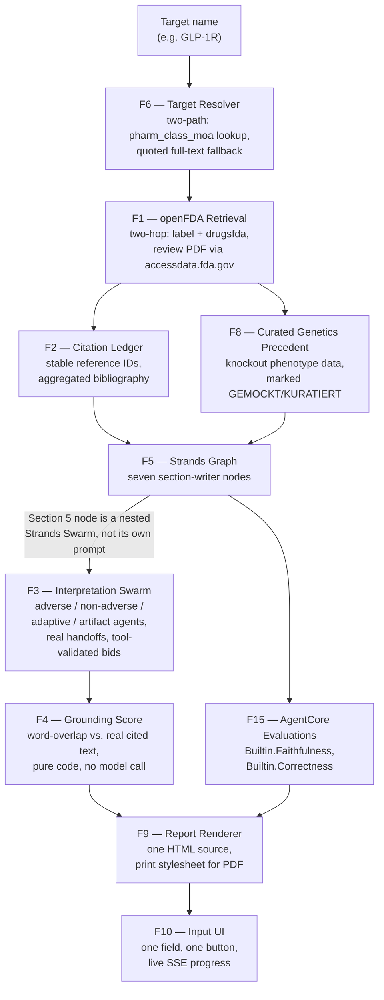

# First Pass

**Target in. Cited Target Safety Assessment out.**

A regulatory/nonclinical toxicologist starting work on a new drug target spends days clicking through FDA and EPA portals before she can even begin forming a judgment on adversity. First Pass automates that first pass: type a target name, and minutes later a complete, fully-cited Target Safety Assessment is on the table — the same document a toxicologist hands to a Discovery team or Safety Committee, and the document that later feeds CTD Module 2.4/2.6.

**Live:** https://first-pass-beige.vercel.app (three demo targets — `GLP-1R`, `HER2`, `KRAS` — return instantly from a pre-computed run; any other target name runs the full pipeline live, in ~100-165s)

## The principles

1. **No sentence without a clickable source.** Every claim carries an inline citation; every citation resolves to a full bibliography entry with document title, FDA application number, date, and URL.
2. **The dispute stays in the document.** Where four interpretations of a finding are possible, the report shows all four with their grounding scores — not a smoothed majority opinion.
3. **Deterministic code decides, the model proposes.** Citation validity and grounding are word-overlap arithmetic against the real retrieved text, not a second model call.
4. **The judgment stays with the human.** First Pass never sets a NOAEL, never makes an acceptance statement, and never gives safety advice.
5. **The morning report is the interface.** Target name in, finished document out. No chat, no live agent log, no supervision required.

## Architecture



The Section 5 adversity panel is not a separate agent call bolted onto the report — it is a real Strands `Swarm` (four stance-committed agents that hand off to each other via the framework's own `handoff_to_agent` tool) nested directly as one node inside the seven-node Strands `Graph`. A judge inspecting the code sees one composed multi-agent system, not two systems described in the same paragraph.

### Why the target resolver is the load-bearing hop, not a convenience

openFDA cannot be searched by target name. A restricted search against `nonclinical_toxicology` for `HER2`, `KRAS`, or `EGFR` returns **zero hits for all three** — but drug names are indexed (`trastuzumab` → 13 hits, `semaglutide` → 10). Every downstream feature searches by drug name, never by target name, and a resolver failure here is a silent empty-report bug, not a loud one. The resolver tries two paths: an `openfda.pharm_class_moa` lookup against a verified alias table, falling back to a quoted full-text label search (quoted, because an unquoted multi-word query gets OR-tokenized by openFDA's search engine and can match almost the entire label corpus on stray common words — verified live, documented in the codebase).

### Why the grounding score is plain word overlap, not another model call

If the report-writing model has a faithfulness bug, a second model call asked to grade faithfulness can plausibly share the same blind spot. `score_claim` is a stopword-filtered word-overlap ratio between a claim and the real source text it cites — simple enough to audit by hand, and the mechanism the Proof beat uses to show a manipulated citation visibly losing its grounding highlight.

## Deployment

Runs as a single Vercel Python (FastAPI) serverless function — `app/main.py`, using Vercel's native FastAPI framework preset. The function calls Amazon Bedrock (the pinned model, via a cross-region inference profile) and AgentCore Evaluations directly, authenticated as a dedicated IAM identity scoped to exactly `bedrock:InvokeModel`/`InvokeModelWithResponseStream` on the pinned model and `bedrock-agentcore:Evaluate` on the built-in evaluators — never an admin credential, and the keys live only in Vercel's encrypted environment variables, never in this repository.

One HTTP request streams the whole run over Server-Sent Events: progress per stage, a heartbeat comment every 15s during long silent stages (the section-writer graph alone runs 60-90s as a single call), and a terminal event carrying the finished report HTML. No cross-request state, which is what makes this safe to run on a platform where separate requests can land on different function instances.

The three curated demo targets are pre-computed and served from cache with a visible "served from a pre-computed demo run" banner — a live Bedrock call per visitor click is not sustainable for a project that has to stay freely testable for weeks after submission, and this is the mechanism that keeps it so. Any other target name runs the full live pipeline.

**Known limitation:** the live-run rate limit is tracked in each function instance's own process memory, not a shared store. Vercel can route concurrent requests to different instances, each with an independent lock and timestamp, so two simultaneous live runs on different instances are not serialized against each other the way the single-process rate limit intends. The AWS billing alarm (Bedrock/AgentCore, scoped to this project) is the actual backstop against runaway spend; closing the gap properly would need an external shared store (Redis, DynamoDB) coordinating across instances, which was out of scope for this build.

## Tech stack

- **AWS Strands Agents SDK** (Python) — `Graph` (seven section writers) and `Swarm` (four interpretation agents), nested as described above
- **Amazon Bedrock** — `converse` API, pinned to `us.anthropic.claude-sonnet-4-5-20250929-v1:0` via cross-region inference profile
- **Amazon Bedrock AgentCore Evaluations** — `Builtin.Faithfulness`, `Builtin.Correctness`, invoked via boto3 against a captured OpenTelemetry trace of the actual report-generation run
- **openFDA** (`api.fda.gov`) — unauthenticated, two-hop retrieval (label + drugsfda + accessdata.fda.gov review documents)
- **FastAPI**, deployed as a Vercel Python serverless function
- **Vanilla HTML/CSS/JS** frontend — deliberately unstyled relative to the retrieval/scoring/citation layers, which are the carefully-built part

## Running locally

```bash
python3.11 -m venv .venv && source .venv/bin/activate
pip install -r requirements-dev.txt  # requirements.txt is the deployed runtime set; -dev adds uvicorn/pytest
export AWS_REGION=us-west-2  # region matters: see backend/config.py
uvicorn backend.api:app --reload --port 8000
```

Then open `http://localhost:8000`. Running the test suite (`pytest`) hits real openFDA and, where Bedrock access is available, real Bedrock/AgentCore calls — no mocks.

## What this deliberately does not do

- Set a NOAEL, or make any acceptance/safety statement — that judgment belongs to the reviewing toxicologist
- Process real (non-synthetic) study reports
- Automate EPA portal retrieval (out of scope for this build)
- Require a login, store user accounts, or persist a run past its own session

## License

MIT — see [LICENSE](LICENSE).
